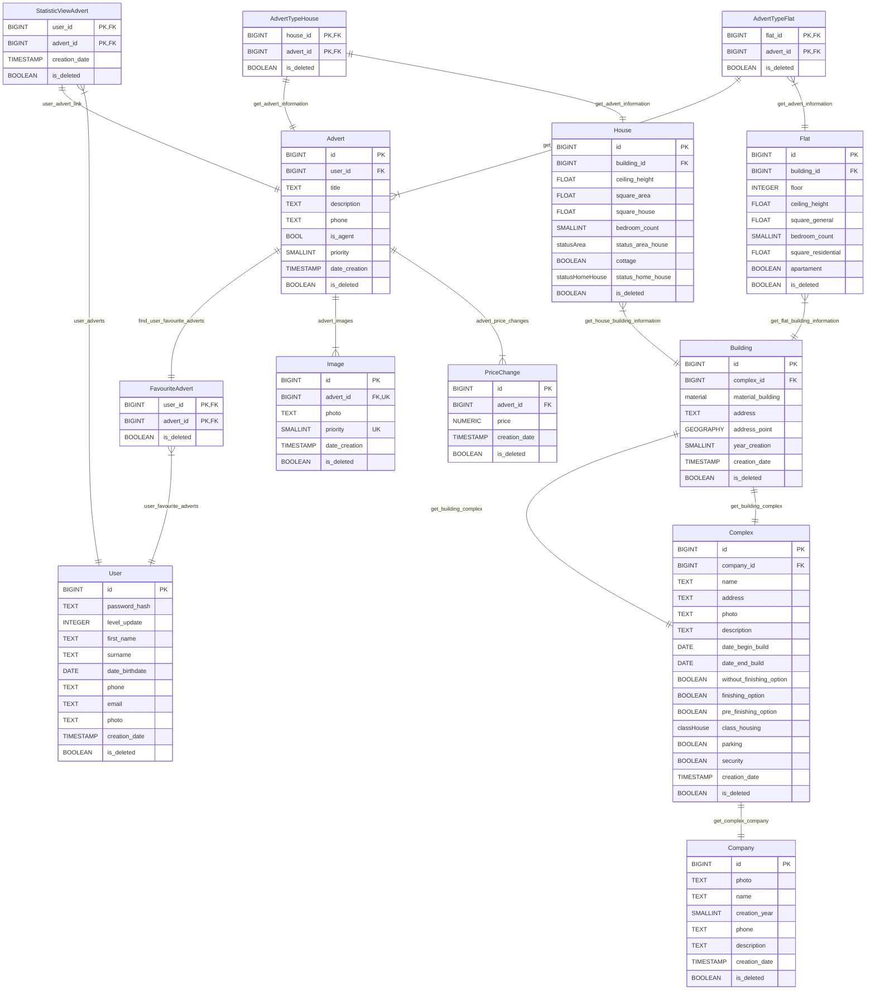

# Описание таблиц
## User
- level_update уровень jwt токена
- creation_date время создания аккаунта

## Advert
- user_id айди пользователа владельца объявления
- is_agent выставлено ли объявление риелтором
- priority какой рэйтинг продвижения объявления

## StatisticViewAdvert
### используется для просмотра объявлений конкретного пользователя

## FavouriteAdvert
### используется для хранения избранных объявлений пользователей

## Image
- photo содержит путь до фотографии
- priority приоритет изображения, определяет в каком порядке будут показываться в объявлении

## PriceChange
### содержит информацию об измениях цен в объявлениях
- price цена указанная в объявлении

## AdvertTypeHouse
### испоьзуется для загрузки объявлений с домами
- advert_id - id соотв. объявления
- house_id - id дома в объявлении

## AdvertTypeFlat
### аналогично как с AdvertTypeHouse

## House
### хранит информацию о параметрах дома
- building_id содержит информацию о материале и местоположении дома
- square_area площадь участка
- square_house площадь дома
- statis_area_house

## Flat
### хранит информацию о параметрах квартиры
- floor на каком этаже квартира
- square_general общая площадь квартиры
- bedroom_count однушка, двушка и т.д.
- square_residential - площадь спален?

## Building
### информация о здании
- material_building - из какого материала здание построено кирпич, блоки и т.п.
- address_point - координаты дома
- year_creation - год завершения постройки здания

## Complex
### информация о комплексе или доп информация о здании
- without_finishing_option - без отделки
- pre_finishing_option - с частичной отделкой
- finishing_option - с отделкой
- class_housing - статус комплекса
- security - охрана

## Company
### информация о застройщике
- photo - путь до логотипа компании