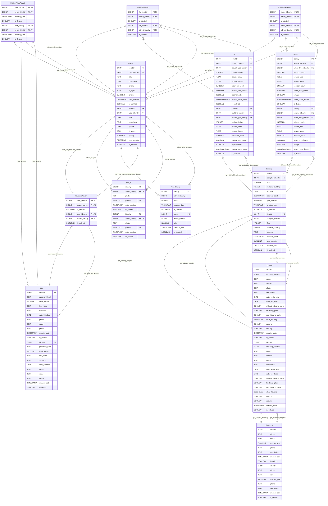

```mermaid
erDiagram
    User {
        BIGINT identity PK
        TEXT password_hash
        INTEGER level_update
        TEXT first_name
        TEXT surname
        DATE date_birthdate
        TEXT phone
        TEXT email
        TEXT photo
        TIMESTAMP creation_date
        BOOLEAN is_deleted
    }
    
    FavouriteAdvert {
        BIGINT user_identity PK,FK
        BIGINT advert_identity PK,FK
        BOOLEAN is_deleted
    }

        FavouriteAdvert |{--|| User : user_favourite_adverts

    StatisticViewAdvert {
        BIGINT user_identity PK,FK
        BIGINT advert_identity PK,FK
        TIMESTAMP creation_date
        BOOLEAN is_deleted
    }

    StatisticViewAdvert ||--|| Advert : user_advert_link
    StatisticViewAdvert }|--|| User : user_adverts
    Advert ||--|| FavouriteAdvert : find_user_favourite_adverts
 

    AdvertTypeHouse {
        BIGINT house_identity PK, FK
        BIGINT advert_identity PK, FK
        BOOLEAN is_deleted
    }
    AdvertTypeHouse ||--|| Advert : get_advert_information
    AdvertTypeHouse ||--|| House : get_advert_information

    AdvertTypeFlat {
        BIGINT flat_identity PK, FK
        BIGINT advert_identity PK, FK
        BOOLEAN is_deleted
    }
    AdvertTypeFlat ||--}| Advert : get_advert_information
    AdvertTypeFlat }|--|| Flat : get_advert_information


    Flat {
        BIGINT identity PK
        BIGINT building_identity FK
        BIGINT advert_type_identity FK
        INTEGER ceilong_height
        FLOAT square_area
        FLOAT square_house
        SMALLINT bedroom_count
        statusArea status_area_house
        BOOLEAN apartaments
        statusHomeHouse status_home_house
        BOOLEAN is_deleted
    }

    Flat }|--|| Building : get_flat_building_information

    House {
        BIGINT identity PK
        BIGINT building_identity FK
        BIGINT advert_type_identity FK
        INTEGER ceilong_height
        FLOAT square_area
        FLOAT square_house
        SMALLINT bedroom_count
        statusArea status_area_house
        BOOLEAN cottage
        statusHomeHouse status_home_house
        BOOLEAN is_deleted
    }
    House }|--|| Building : get_house_building_information

    Building {
        BIGINT identity PK
        BIGINT complex_identity FK
        INTEGER floor
        material material_building
        TEXT address
        GEOGRAPHY address_point
        SMALLINT year_creation
        TIMESTAMP creation_date
        BOOLEAN is_deleted
    }
    Building ||--|| Complex : get_building_complex

    Complex {
        BIGINT identity
        BIGINT company_identity
        TEXT name
        TEXT address
        TEXT photo
        TEXT description
        DATE date_begin_build
        DATE date_end_build
        BOOLEAN without_finishing_option
        BOOLEAN finishing_option
        BOOLEAN pre_finishing_option
        classHouse class_housing
        BOOLEAN parking
        BOOLEAN security
        TIMESTAMP creation_date
        BOOLEAN is_deleted
    }
    Building ||--|| Complex : get_building_complex
    Complex ||--|| Company : get_complex_company


    Company {
        BIGINT identity
        TEXT photo
        TEXT name
        SMALLINT creation_year
        TEXT phone
        TEXT description
        TIMESTAMP creation_date
        BOOLEAN is_deleted
    }
    Advert {
        BIGINT identity PK
        BIGINT user_identity FK
        TEXT title
        TEXT description
        TEXT phone
        BOOL is_agent
        SMALLINT priority
        TIMESTAMP date_creation
        BOOLEAN is_deleted
    }
    Advert ||--|{ Image : advert_images

    Image {
        BIGINT identity PK
        BIGINT advert_identity FK,UK
        TEXT photo
        SMALLINT priority UK
        TIMESTAMP date_creation
        BOOLEAN is_deleted

    }
    
    Advert ||--|{ PriceChange : advert_price_changes

    PriceChange {
        BIGINT identity PK
        BIGINT advert_identity
        NUMERIC price
        TIMESTAMP creation_date
        BOOLEAN is_deleted

    }
    User {
        BIGINT identity PK
        TEXT password_hash
        INTEGER level_update
        TEXT first_name
        TEXT surname
        DATE date_birthdate
        TEXT phone
        TEXT email
        TEXT photo
        TIMESTAMP creation_date
        BOOLEAN is_deleted
    }
    
    FavouriteAdvert {
        BIGINT user_identity PK,FK
        BIGINT advert_identity PK,FK
        BOOLEAN is_deleted
    }

        FavouriteAdvert |{--|| User : user_favourite_adverts

    StatisticViewAdvert {
        BIGINT user_identity PK,FK
        BIGINT advert_identity PK,FK
        TIMESTAMP creation_date
        BOOLEAN is_deleted
    }

    StatisticViewAdvert ||--|| Advert : user_advert_link
    StatisticViewAdvert }|--|| User : user_adverts
    Advert ||--|| FavouriteAdvert : find_user_favourite_adverts
 

    AdvertTypeHouse {
        BIGINT house_identity PK, FK
        BIGINT advert_identity PK, FK
        BOOLEAN is_deleted
    }
    AdvertTypeHouse ||--|| Advert : get_advert_information
    AdvertTypeHouse ||--|| House : get_advert_information

    AdvertTypeFlat {
        BIGINT flat_identity PK, FK
        BIGINT advert_identity PK, FK
        BOOLEAN is_deleted
    }
    AdvertTypeFlat ||--}| Advert : get_advert_information
    AdvertTypeFlat }|--|| Flat : get_advert_information


    Flat {
        BIGINT identity PK
        BIGINT building_identity FK
        BIGINT advert_type_identity FK
        INTEGER ceilong_height
        FLOAT square_area
        FLOAT square_house
        SMALLINT bedroom_count
        statusArea status_area_house
        BOOLEAN apartaments
        statusHomeHouse status_home_house
        BOOLEAN is_deleted
    }

    Flat }|--|| Building : get_flat_building_information

    House {
        BIGINT identity PK
        BIGINT building_identity FK
        BIGINT advert_type_identity FK
        INTEGER ceilong_height
        FLOAT square_area
        FLOAT square_house
        SMALLINT bedroom_count
        statusArea status_area_house
        BOOLEAN cottage
        statusHomeHouse status_home_house
        BOOLEAN is_deleted
    }
    House }|--|| Building : get_house_building_information

    Building {
        BIGINT identity PK
        BIGINT complex_identity FK
        INTEGER floor
        material material_building
        TEXT address
        GEOGRAPHY address_point
        SMALLINT year_creation
        TIMESTAMP creation_date
        BOOLEAN is_deleted
    }
    Building ||--|| Complex : get_building_complex

    Complex {
        BIGINT identity
        BIGINT company_identity
        TEXT name
        TEXT address
        TEXT photo
        TEXT description
        DATE date_begin_build
        DATE date_end_build
        BOOLEAN without_finishing_option
        BOOLEAN finishing_option
        BOOLEAN pre_finishing_option
        classHouse class_housing
        BOOLEAN parking
        BOOLEAN security
        TIMESTAMP creation_date
        BOOLEAN is_deleted
    }
    Building ||--|| Complex : get_building_complex
    Complex ||--|| Company : get_complex_company


    Company {
        BIGINT identity
        TEXT photo
        TEXT name
        SMALLINT creation_year
        TEXT phone
        TEXT description
        TIMESTAMP creation_date
        BOOLEAN is_deleted
    }
    Advert {
        BIGINT identity PK
        BIGINT user_identity FK
        TEXT title
        TEXT description
        TEXT phone
        BOOL is_agent
        SMALLINT priority
        TIMESTAMP date_creation
        BOOLEAN is_deleted
    }
    Advert ||--|{ Image : advert_images

    Image {
        BIGINT identity PK
        BIGINT advert_identity FK,UK
        TEXT photo
        SMALLINT priority UK
        TIMESTAMP date_creation
        BOOLEAN is_deleted

    }
    
    Advert ||--|{ PriceChange : advert_price_changes

    PriceChange {
        BIGINT identity PK
        BIGINT advert_identity
        NUMERIC price
        TIMESTAMP creation_date
        BOOLEAN is_deleted

    }
```

