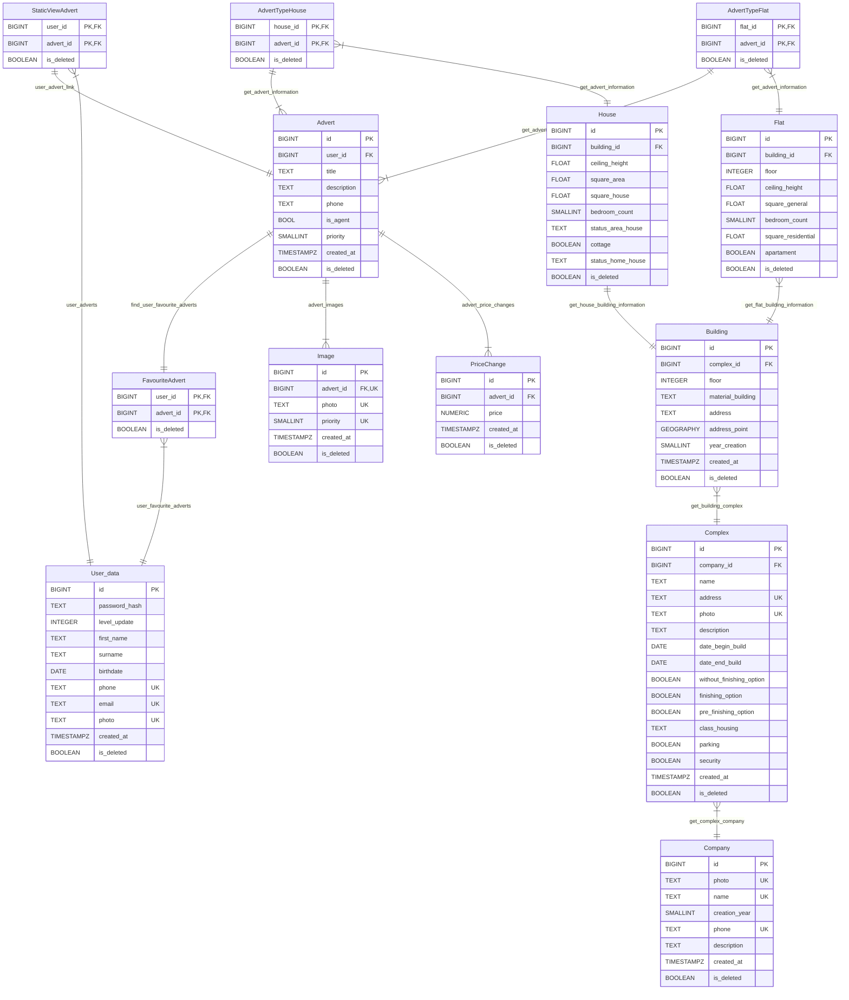

#

is_deleted в таблицах используется для возможности просмотра удалённых объявлений, его восстановления, возможности сбора дополнительной статистики.

# Описание таблиц
## User_data
Таблица хранит информацию о пользователе, и о его jwt.
- id
- password_hash
- level_update
- first_name
- surname
- birthdate
- phone
- email
- photo
- created_at
- is_deleted
- level_update - уровень jwt токена
- created_at -  время создания аккаунта

{id} -> password_hash, level_update, first_name, surname, birthdate, phone, email, photo, created_at, is_deleted

{phone} -> id, password_hash, level_update, first_name, surname, birthdate, email, photo, created_at, is_deleted

{email} -> id, password_hash, level_update, first_name, surname, birthdate, phone, photo, created_at, is_deleted

### Нормальные формы

Правилом первой формы является необходимость неделимости значения в каждом поле (столбце) строки – атомарность значений.

Первая форма - каждое поле в таблицах неделимое - атомарность значение.

Вторая форма - нет зависимости неключевых полей от части составного ключа.

Третья форма - нет зависимости неключевых полей от других неключевых полей.

Переменная отношения находится в НФБК тогда и только тогда, когда для любой нетривиальной функциональной зависимости X→Y, X является надключом.

Данная таблица удовлетворяет этим условиям.

## Advert
Таблица хранит описание, название объявления, контакты владельца. Потом связывается с жильём через другие таблицы.
- id
- user_id - айди пользователя владельца объявления
- title
- description
- phone - номер не уникальный так как один пользователь может много выложить объявлений
- is_agent - выставлено ли объявление риелтором
- priority - какой рейтинг продвижения объявления
- created_at
- is_deleted

{id} -> user_id, title, description, phone, priority, created_at, is_deleted

### Нормальные формы

Правилом первой формы является необходимость неделимости значения в каждом поле (столбце) строки – атомарность значений.

Первая форма - каждое поле в таблицах неделимое - атомарность значение.

Вторая форма - нет зависимости неключевых полей от части составного ключа.

Третья форма - нет зависимости неключевых полей от других неключевых полей.

Переменная отношения находится в НФБК тогда и только тогда, когда для любой нетривиальной функциональной зависимости X→Y, X является надключом.

Данная таблица удовлетворяет этим условиям.

## StaticViewAdvert
Таблица позволяет просматривать созданные пользователем объявления в его личном кабинете.
- user_id - для просмотра объявлений конкретного пользователя
- advert_id
- is_deleted

{user_id, advert_id} -> is_deleted

### Нормальные формы

Правилом первой формы является необходимость неделимости значения в каждом поле (столбце) строки – атомарность значений.

Первая форма - каждое поле в таблицах неделимое - атомарность значение.

Вторая форма - нет зависимости неключевых полей от части составного ключа.

Третья форма - нет зависимости неключевых полей от других неключевых полей.

Переменная отношения находится в НФБК тогда и только тогда, когда для любой нетривиальной функциональной зависимости X→Y, X является надключом.

Данная таблица удовлетворяет этим условиям.

## FavouriteAdvert
Таблица позволяет просматривать добавленные в избранное пользователем объявления в его личном кабинете.
- user_id - для просмотра избранных объявлений пользователем
- advert_id
- is_deleted

{user_id, advert_id} -> is_deleted

### Нормальные формы

Правилом первой формы является необходимость неделимости значения в каждом поле (столбце) строки – атомарность значений.

Первая форма - каждое поле в таблицах неделимое - атомарность значение.

Вторая форма - нет зависимости неключевых полей от части составного ключа.

Третья форма - нет зависимости неключевых полей от других неключевых полей.

Переменная отношения находится в НФБК тогда и только тогда, когда для любой нетривиальной функциональной зависимости X→Y, X является надключом.

Данная таблица удовлетворяет этим условиям.

## Image
Таблица хранит изображения, которые используются в объявлениях.
- id
- advert_id
- photo
- priority - в каком порядке будут показываться изображения в объявлении
- created_at
- is_deleted
- photo - содержит путь до фотографии
- priority - приоритет изображения определяет в каком порядке будут показываться в объявлении

{id} -> advert_id, photo, priority, created_at, is_deleted

{advert_id, priority} -> id, photo, created_at,is_deleted

### Нормальные формы

Правилом первой формы является необходимость неделимости значения в каждом поле (столбце) строки – атомарность значений.

Первая форма - каждое поле в таблицах неделимое - атомарность значение.

Вторая форма - нет зависимости неключевых полей от части составного ключа.

Третья форма - нет зависимости неключевых полей от других неключевых полей.

Переменная отношения находится в НФБК тогда и только тогда, когда для любой нетривиальной функциональной зависимости X→Y, X является надключом.

Данная таблица удовлетворяет этим условиям.

## PriceChange
Таблица хранит цену которая стала у объявления в момент created_at.
- id
- advert_id
- price - цена указанная в объявлении
- created_at
- is_deleted

{id} -> advert_id, price, created_at, is_deleted

### Нормальные формы

Правилом первой формы является необходимость неделимости значения в каждом поле (столбце) строки – атомарность значений.

Первая форма - каждое поле в таблицах неделимое - атомарность значение.

Вторая форма - нет зависимости неключевых полей от части составного ключа.

Третья форма - нет зависимости неключевых полей от других неключевых полей.

Переменная отношения находится в НФБК тогда и только тогда, когда для любой нетривиальной функциональной зависимости X→Y, X является надключом.

Данная таблица удовлетворяет этим условиям.

## AdvertTypeHouse
Таблица связывает объявление с жильём, позволяет получить информацию об объявлении и о доме.
- advert_id - id соотв. объявления
- house_id - id дома в объявлении
- is_deleted

{advert_id, house_id} -> is_deleted

### Нормальные формы

Правилом первой формы является необходимость неделимости значения в каждом поле (столбце) строки – атомарность значений.

Первая форма - каждое поле в таблицах неделимое - атомарность значение.

Вторая форма - нет зависимости неключевых полей от части составного ключа.

Третья форма - нет зависимости неключевых полей от других неключевых полей.

Переменная отношения находится в НФБК тогда и только тогда, когда для любой нетривиальной функциональной зависимости X→Y, X является надключом.

Данная таблица удовлетворяет этим условиям.

## AdvertTypeFlat
Таблица связывает объявление с жильём, позволяет получить информацию об объявлении и о квартире.
- flat_id
- advert_id
- is_deleted

{advert_id, flat_id} -> is_deleted

### Нормальные формы

Правилом первой формы является необходимость неделимости значения в каждом поле (столбце) строки – атомарность значений.

Первая форма - каждое поле в таблицах неделимое - атомарность значение.

Вторая форма - нет зависимости неключевых полей от части составного ключа.

Третья форма - нет зависимости неключевых полей от других неключевых полей.

Переменная отношения находится в НФБК тогда и только тогда, когда для любой нетривиальной функциональной зависимости X→Y, X является надключом.

Данная таблица удовлетворяет этим условиям.

## House
Таблица хранит информацию о доме.
- id
- building_id - содержит информацию о материале и местоположении дома
- ceiling_height
- square_area - площадь участка
- square_house - площадь дома
- bedroom_count
- status_area_house - статус(состояние) участка
- cottage
- status_home_house - статус(состояние) дома
- is_deleted

{id} -> building_id, ceiling_height, square_area, square_house, bedroom_count, status_area_house, cottage, status_home_house, is_deleted

### Нормальные формы

Правилом первой формы является необходимость неделимости значения в каждом поле (столбце) строки – атомарность значений.

Первая форма - каждое поле в таблицах неделимое - атомарность значение.

Вторая форма - нет зависимости неключевых полей от части составного ключа.

Третья форма - нет зависимости неключевых полей от других неключевых полей.

Переменная отношения находится в НФБК тогда и только тогда, когда для любой нетривиальной функциональной зависимости X→Y, X является надключом.

Данная таблица удовлетворяет этим условиям.

## Flat
Таблица хранит информацию о квартире.
- id
- building_id
- floor - на каком этаже квартира
- ceiling_height
- square_general - общая площадь квартиры
- bedroom_count - однушка, двушка и т.д.
- square_residential - площадь спален
- apartament
- is_deleted

{id} -> building_id, floor, square_general, bedroom_count, square_residential, apartament,is_deleted

### Нормальные формы

Правилом первой формы является необходимость неделимости значения в каждом поле (столбце) строки – атомарность значений.

Первая форма - каждое поле в таблицах неделимое - атомарность значение.

Вторая форма - нет зависимости неключевых полей от части составного ключа.

Третья форма - нет зависимости неключевых полей от других неключевых полей.

Переменная отношения находится в НФБК тогда и только тогда, когда для любой нетривиальной функциональной зависимости X→Y, X является надключом.

Данная таблица удовлетворяет этим условиям.

## Building
Таблица хранит информацию о самом здании.
- id
- complex_id
- floor - сколько этажей в доме или квартире
- material_building - из какого материала здание построено кирпич, блоки и т.п.
- address
- address_point - координаты дома
- year_creation - год завершения постройки здания
- created_at
- is_deleted

{id} -> complex_id, material_building, address, address_point, year_creation, created_at, is_deleted

{address} -> id, complex_id, material_building, address_point, created_at, is_deleted

{address_point} -> id, complex_id, material_building, address, created_at, is_deleted

### Нормальные формы

Правилом первой формы является необходимость неделимости значения в каждом поле (столбце) строки – атомарность значений.

Первая форма - каждое поле в таблицах неделимое - атомарность значение.

Вторая форма - нет зависимости неключевых полей от части составного ключа.

Третья форма - нет зависимости неключевых полей от других неключевых полей.

Переменная отношения находится в НФБК тогда и только тогда, когда для любой нетривиальной функциональной зависимости X→Y, X является надключом.

Данная таблица удовлетворяет этим условиям.

## Complex
Таблица хранит информацию о жилищном комплексе в целом или если частный дом/квартира дополнительную информацию о квартире(отделку и т.д.)
- id
- company_id
- name
- address
- photo
- description
- date_begin_build
- date_end_build
- without_finishing_option - без отделки
- pre_finishing_option - с частичной отделкой
- finishing_option - с отделкой
- class_housing - класс(престижность) комплекса
- parking
- security - есть ли охрана в комплексе(проходная с охраной)
- created_at
- is_deleted

{id} -> company_id, name, address, photo, description, date_begin_build, date_end_build, without_finishing_option, finishing_option, pre_finishing_option,
class_housing, parking, security, created_at, is_deleted

### Нормальные формы

Правилом первой формы является необходимость неделимости значения в каждом поле (столбце) строки – атомарность значений.

Первая форма - каждое поле в таблицах неделимое - атомарность значение.

Вторая форма - нет зависимости неключевых полей от части составного ключа.

Третья форма - нет зависимости неключевых полей от других неключевых полей.

Переменная отношения находится в НФБК тогда и только тогда, когда для любой нетривиальной функциональной зависимости X→Y, X является надключом.

Данная таблица удовлетворяет этим условиям.

## Company
Таблица хранит информацию о компании продавце или контактную информацию о продавце.
- id
- photo - путь до логотипа компании
- name
- creation_year
- phone
- description
- created_at
- is_deleted

{id} -> photo, name, creation_year, phone, description, created_at, is_deleted

### Нормальные формы

Правилом первой формы является необходимость неделимости значения в каждом поле (столбце) строки – атомарность значений.

Первая форма - каждое поле в таблицах неделимое - атомарность значение.

Вторая форма - нет зависимости неключевых полей от части составного ключа.

Третья форма - нет зависимости неключевых полей от других неключевых полей.

Переменная отношения находится в НФБК тогда и только тогда, когда для любой нетривиальной функциональной зависимости X→Y, X является надключом.

Данная таблица удовлетворяет этим условиям.
